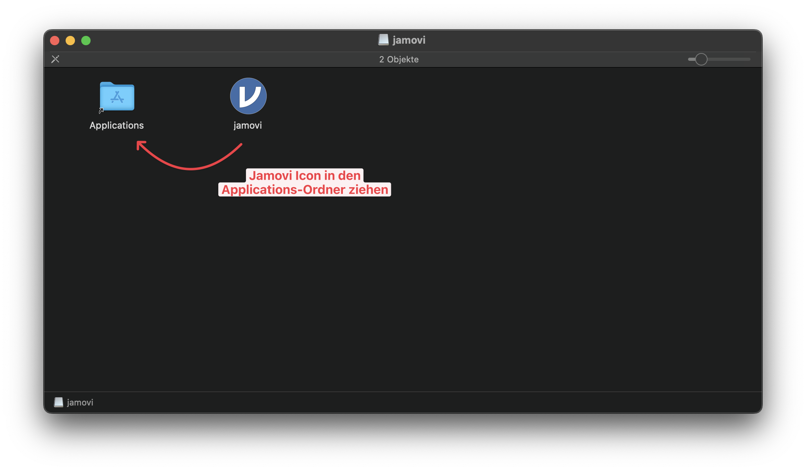
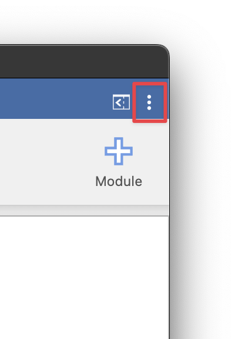

# Einrichtung von jamovi auf Mac
## Download
Die aktuelle jamovi-Version kann von [https://www.jamovi.org/download.html] heruntergeladen werden.

- Für Mac-Computer mit Intel-Chips: Download der **Current**- bzw. x64-Version. 
- Für Mac-Computer mit Apple-Chips (M1/2/3/4): Download der **Apple Silicon**- bzw. arm64-Version

{: .info }
> Den Chip des Mac-Computers findet man im Apple()-Menü unter "Über diesen Mac".

## Installation
Zur Installation muss die heruntergeladene Datei ausgeführt, und das jamovi-Icon in den Applications-Ordner gezogen werden.

<!--Bild als html, damit es bei Klick groß in neuem Tab geöffnet wird-->

<!---->

## Einrichtung
Nach der Installation können über das Drei-Punkte-Menü in der oberen rechten Ecke Einstellungen vorgenommen werden.
Hier sollte "Format des _p_-Wertes" auf **3 dp** gesetzt werden.

<!---->

In der Ergebnisausgabe werden dadurch entsprechend der aktuellen APA/DGPs Manuskriptvorgaben alle _p_-Werte mit drei Nachkommastellen und alle weiteren Zahlenwerte mit zwei Nachkommastellen angezeigt.

[https://www.jamovi.org/download.html]: https://www.jamovi.org/download.html