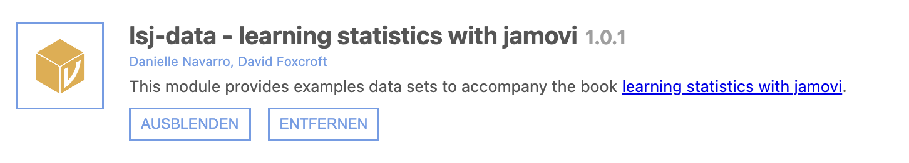
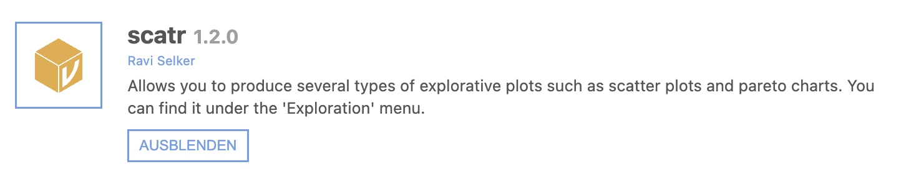

# Zusatzmodule
jamovi bietet eine Bibliothek an Zusatzmodulen an, die ergänzende Funktionen zum Programm hinzufügen. 

Im Zuge der Lehrveranstaltungen werden die folgenden Zusatzmodule genutzt:
- **lsj-data - learning statistics with jamovi** – Enthält Trainingsdaten aus dem Buch ["learning statistics with jamovi"](https://www.learnstatswithjamovi.com/), anhand derer einige dieser Anleitungen erstellt wurden
- **surveymv - Survey Plots** - Survey Plots bietet weitere Möglichkeiten zur Erstellung von Diagrammen
- **scatr** – Ermöglicht die Erstellung von Streudiagrammen und Pareto-Diagrammen
- **Rj - Editor to run R code inside jamovi** - Für die direkte Nutzung von R in jamovi

## Installation

Zur Installation der Zusatzmodule wählt man das Plus-Symbol oben rechts aus und öffnet die "jamovi-Bibliothek".

Aus der Liste wählt man nun die gewünschten Zusatzmodule aus.

## Verwalten der installierten Zusatzmodule

Über das Plus-Symbol können auch alle bereits installierten Zusatzmodule aktualisiert und bei Bedarf in der jamovi Menüleiste aus- oder eingeblendet werden.