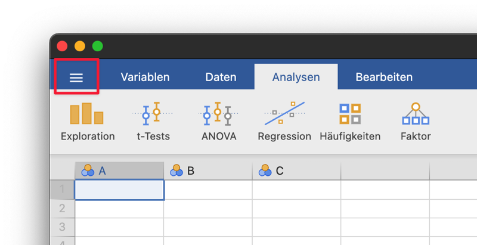
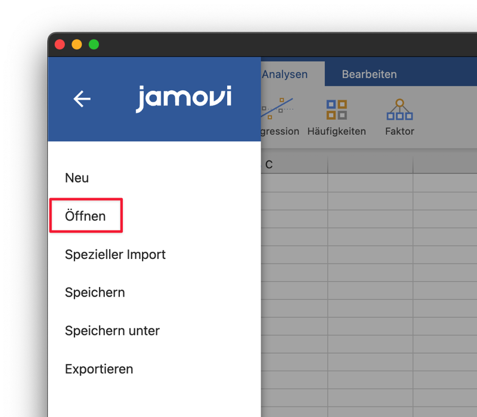
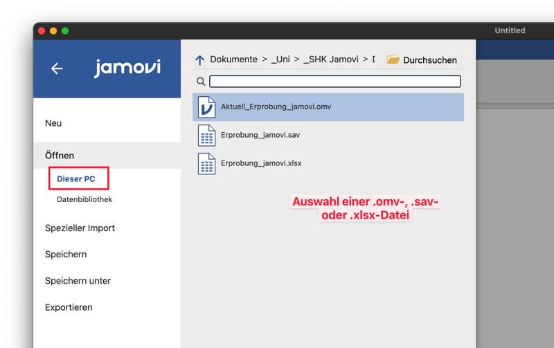
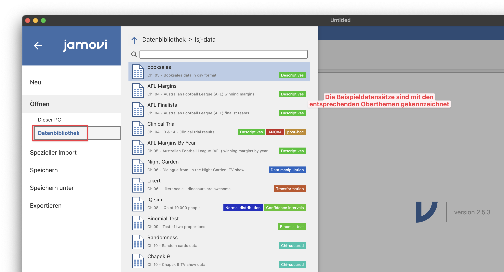

# Einlesen einer .xlsx- oder .sav-Datei

Dateien, die lokal auf dem Rechner gespeichert sind, können über das Menü an der linken Seite geöffnet werden. Dazu muss man lediglich zur gewünschten Datei navigieren und diese auswählen.

{: .info }
> Unterschied zwischen .xlsx- und .sav-Dateien
>
> Bei .sav-Dateien werden die Bezeichnungen der Faktorstufen und das Skalenniveau aus der Datei übernommen, während man das Skalenniveau bei .xlsx-Dateien händisch einstellen muss. 
> Es sollte nach Import geprüft werden, ob Skalenniveau und Faktorstufen korrekt sind.

# Öffnen eines Übungsdatensatzes
Wenn das Zusatzmodul **lsj-data** installiert wurde, enthält jamovi eine Kollektion an Übungsdatensätzen.  
Diese Übungsdatensätze können durch Klick auf "Datenbibliothek" aufgerufen werden.

Die Übungsdatensätze sind mit farbigen Tags mit den Oberthemen, für die sie genutzt werden, gekennzeichnet.
