# Variablenansicht aufbereiten
{: .no_toc }

  

    Inhalt
  

  {: .text-delta }
1. TOC
{:toc}

## Name, Beschreibung, Skalenniveau und Faktorstufen verändern

{: .info }
>Die folgenden Aktionen können entweder im Tab "Variablen" oder in den Menüpunkten "Daten" oder "Analysen" durchgeführt werden. Die Funktionsweise unterscheidet sich nicht.

Über einen Doppelklick auf den Variablennamen öffnet sich eine Ansicht, in der die Variable bearbeitet werden kann. Hier können Name, Beschreibung, Skalenniveau und Faktorstufen eingestellt und verändert werden.

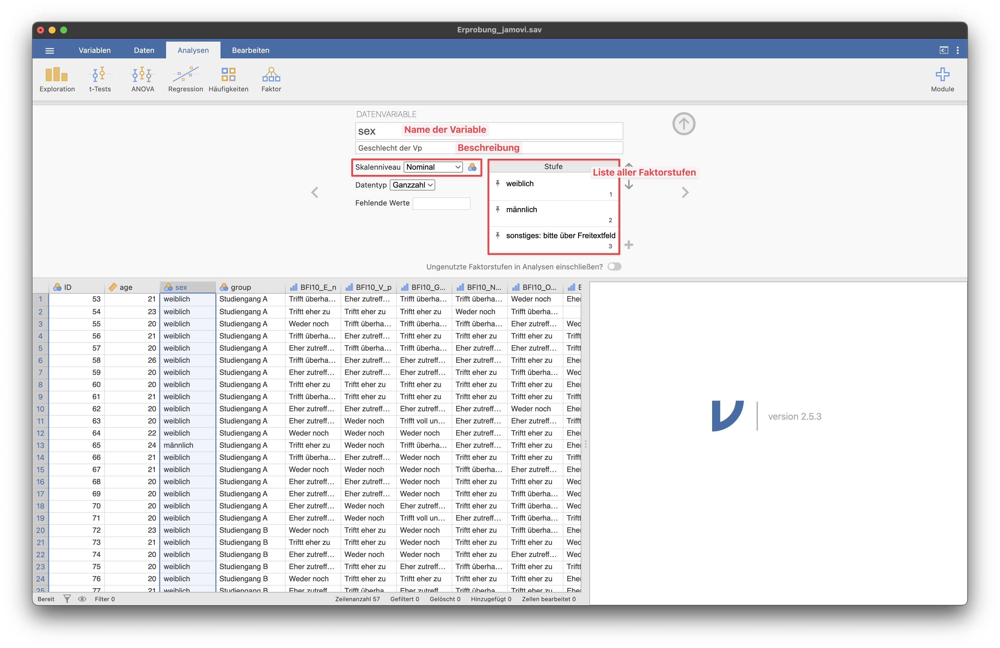

Bei den Skalenniveaus "Nominal" und "Ordinal" werden die in den Daten vorkommenden Faktorstufen automatisch in die Liste der Faktorstufen eingefügt. Weitere Faktorstufen können händisch hinzugefügt werden.
 Hierzu muss man das Plus-Icon anklicken, im sich öffnenden Feld den Wert der neuen Faktorstufe eintragen und auf "OK" klicken.

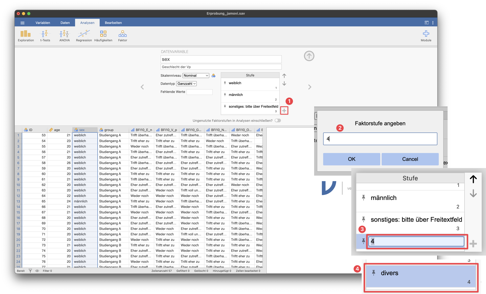

Wenn die hinzugefügte Faktorstufe ein Zahlenwert ist, kann man anschließend die Faktorstufe per Doppelklick auf den neuen Eintrag benennen.

{: .info }
>Setzt man den Haken bei "Ungenutzte Faktorstufen in Analyse einschließen", werden in Auswertungen auch Faktorstufen, die nicht im Datensatz vorkommen, mit einbezogen. (Beispielsweise, wenn auf einer Likert-Skala der Wert 3 kein einziges Mal als Antwort ausgewählt wurde.)

## Fehlende Werte identifizieren und ausschließen
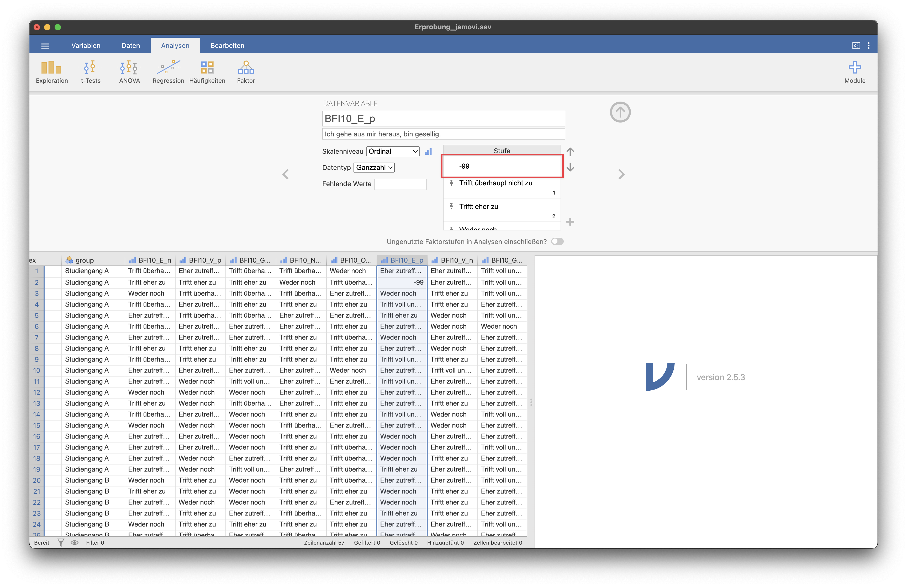

Fehlende Werte wie "0" oder "99" werden in der Liste der Faktorstufen aufgeführt. Um sie aus Auswertungen auszuschließen, müssen sie als "Fehlende Werte" eingetragen werden.

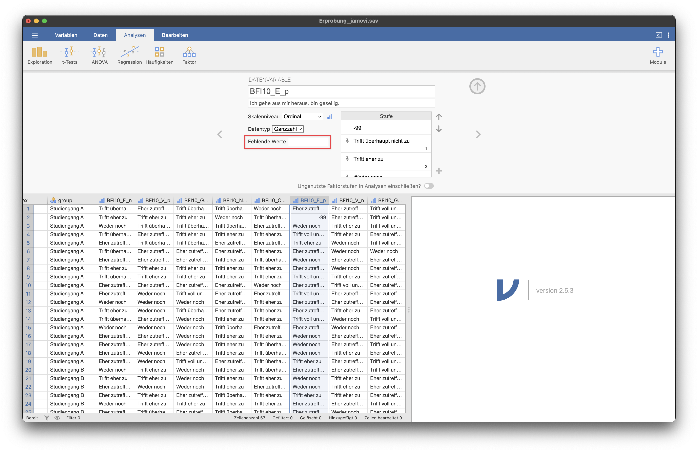

Dies tut man im Feld "Fehlende Werte" über "Fehlenden Wert hinzufügen". Mithilfe von Operatoren können hier entweder einzelne Werte oder Wertebereiche als fehlende Werte definiert werden.

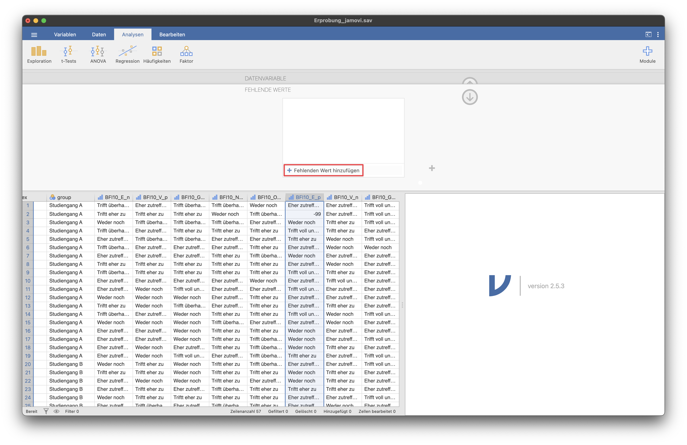
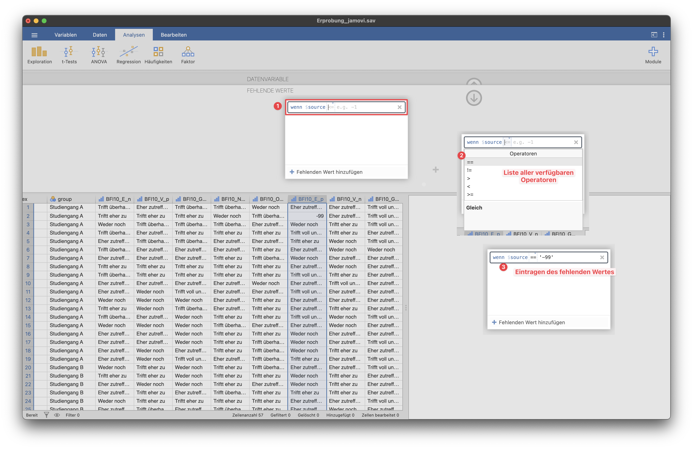
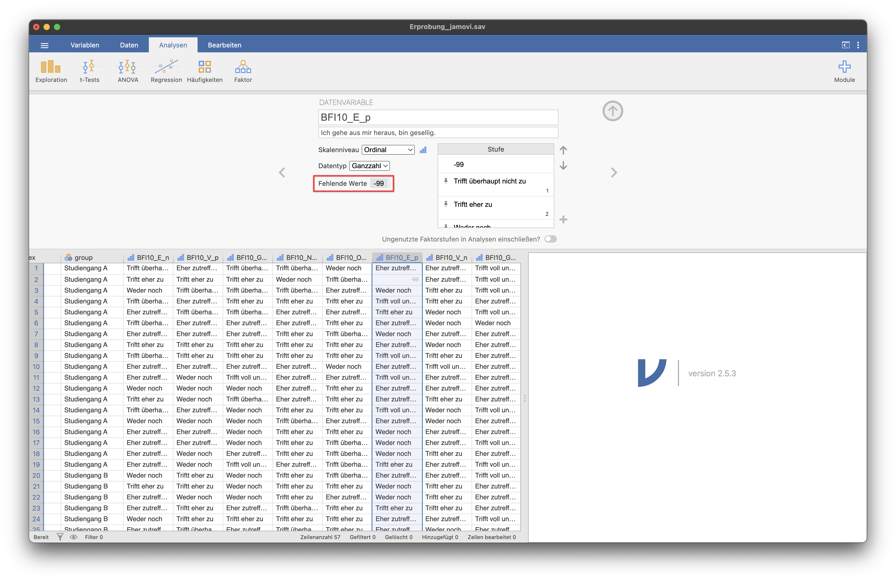

{: .info }
> Die Bedeutung der Operatoren wird im Dropdown erklärt, wenn man mit der Maus darüber fährt. `==` entspricht dem Eintragen der Zahl.  Beispiel: `wenn $source == -99` definiert -99 als fehlenden Wert.

Besonders praktisch: Durch Markieren mehrerer Variablen können Fehlende Werte für mehrere Variablen gleichzeitig definiert werden.

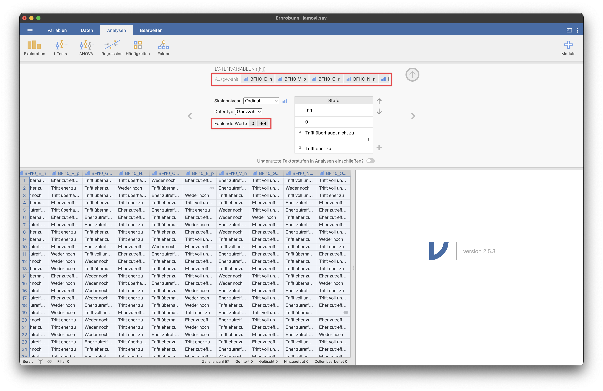

## Items umpolen/umcodieren
Es gibt zwei Möglichkeiten zum umcodieren von Items: Das Berechnen einer neuen Variable, oder die Nutzung einer Transformation.
### Berechnen neuer Variable
Bei der Berechnung einer neuen Variable wird eine neue Variable erstellt. Hierfür wird der Name der neuen Variable festgelegt, und die Formel zur Berechnung definiert.

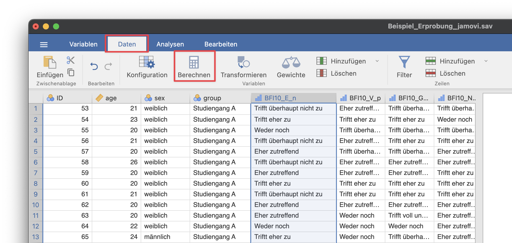
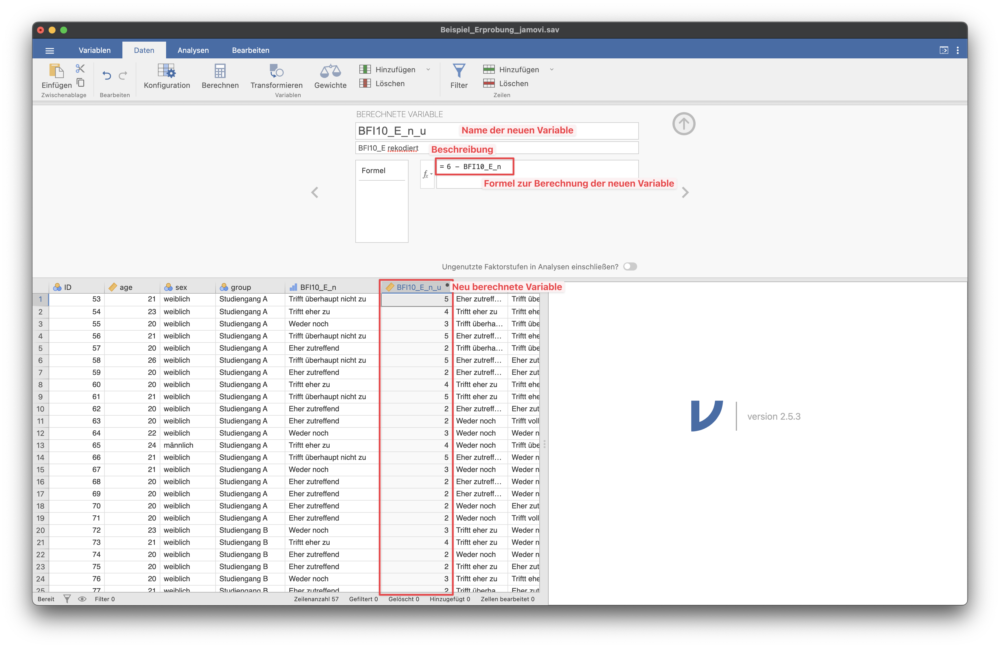

{: .info }
> Um ein negativ gepoltes Item einer 5-stufigen Likert-Skala umzucodieren wird die Formel `6 - "Wert der Ursprungsvariable"` gebraucht. 
> So wird von dem Wert 6 der Wert der Likert-Skala abgezogen, wodurch aus einer 5 eine 1 wird, aus einer 4 eine 2, usw. Es ist also nur eine einzige Aktion notwendig, um alle Werte zu verändern.

### Transformieren
Eine Transformation ist besonders dann hilfreich, wenn eine Umcodierung mehrfach gebraucht wird, da sie immer wieder genutzt werden kann.
Es wird eine neue Transformation erstellt und mit einem Namen, einer Beschreibung, einem Suffix und den Umkodierungsbedingungen befüllt.

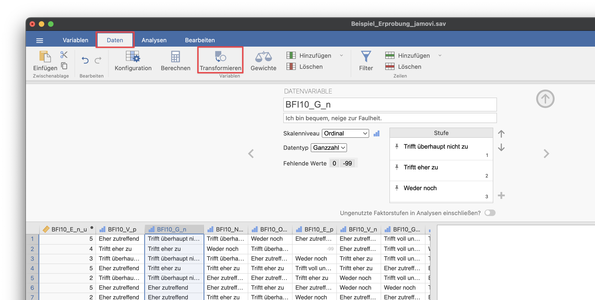
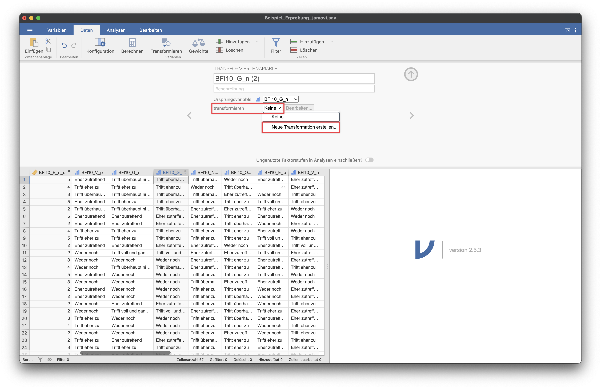
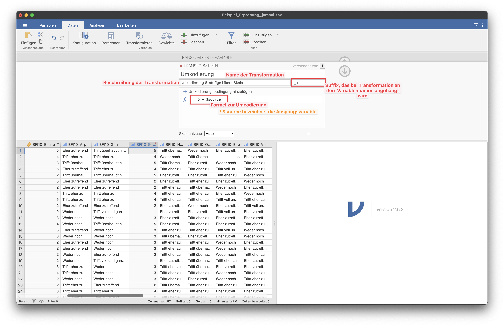

Das "Variablensuffix" ist eine Buchstabenkombination (z.B. "\_u"), die bei Ausführung der Transformation an den Variablennamen angehängt wird.
Die Umkodierungsbedingung ist die Formel zur Berechnung der neuen Variablen. Sie folgt dem gleichen Prinzip wie bei der Berechnung neuer Variablen.

{: .info }
> Um ein negativ gepoltes Item einer 5-stufigen Likert-Skala umzucodieren wird die Formel `6 - "Wert der Ursprungsvariable"` gebraucht. 
> So wird von dem Wert 6 der Wert der Likert-Skala abgezogen, wodurch aus einer 5 eine 1 wird, aus einer 4 eine 2, usw. Es ist also nur eine einzige Aktion notwendig, um alle Werte zu verändern.

Um eine Variable umzukodieren wird die neu angelegte Transformation im Dropdown ausgewählt. jamovi legt dann automatisch eine korrekt benannte, umkodierte Variable an.

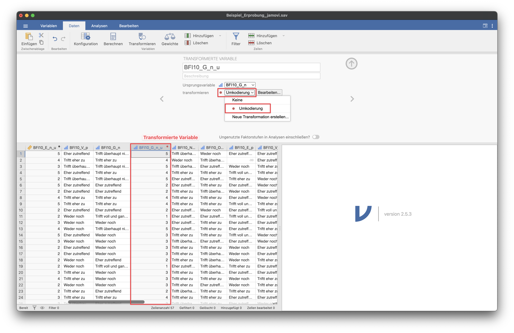

Über die Variablenansicht können auch mehrere Variablen auf einmal umkodiert werden:

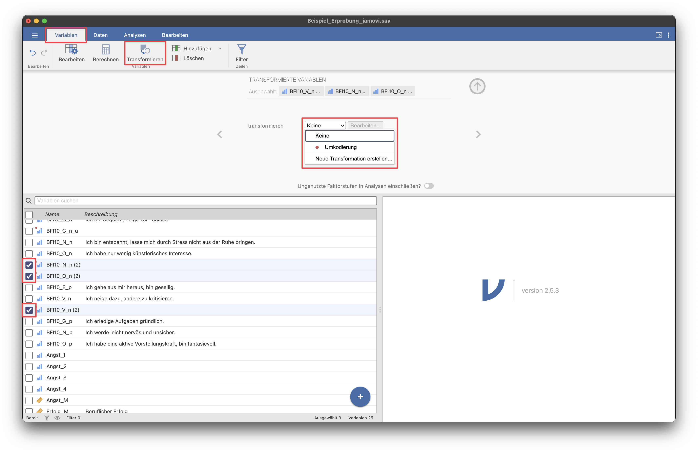
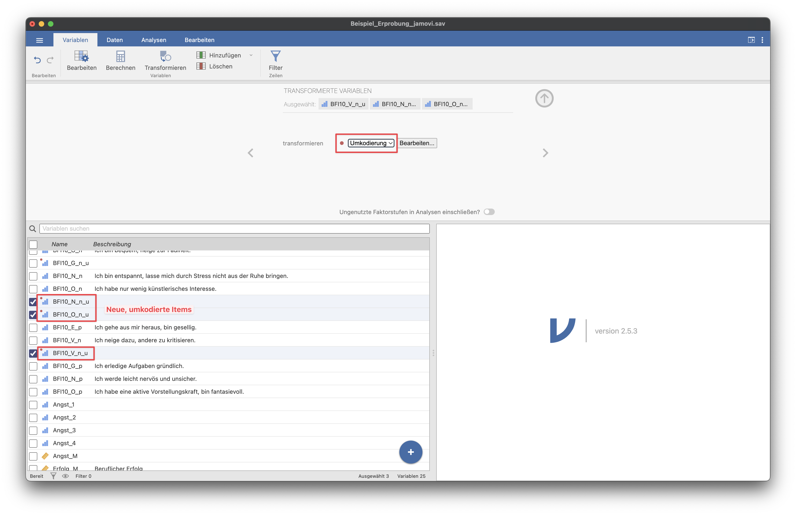

## Skalenaggregation – Berechnung neuer Items

Die Funktion "Berechnen" wird zur Berechnung von neuen Items genutzt. Es können zum Beispiel Mittelwerte (MEAN) oder Summen (SUM) gebildet werden. Über den **fx**-Knopf kann eine Liste aller verfügbarer Elemente für die Formel angezeigt werden, aus der durch Doppelklicken Elemente eingefügt werden können. 

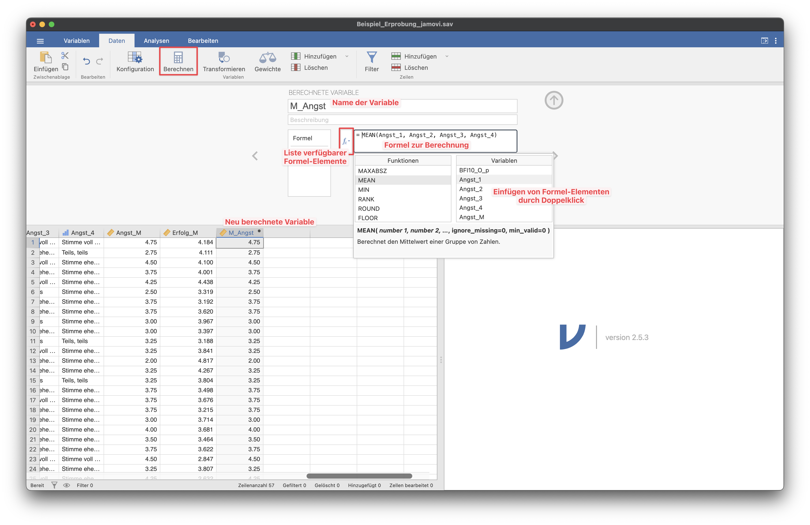

{: .wichtig } 
> Fehlt in einer der eingerechneten Variablen ein Wert, gibt jamovi in der neu berechneten Variablen keinen Wert aus. Um dieses Problem zu lösen, muss `ignore_missing=1` in die Formel eingefügt werden.

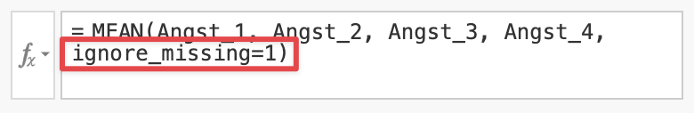

## Nutzung von Filtern

Über den Button "Filter" können Filter eingestellt werden. Die Bedingungen, welche Werte gefiltert werden, werden über eine Formel definiert, und ein Filter kann mehrere Bedingungen beinhalten. jamovi zeigt in der/den ersten Spalte an, welche Fälle durch den Filter ausgeschlossen werden.

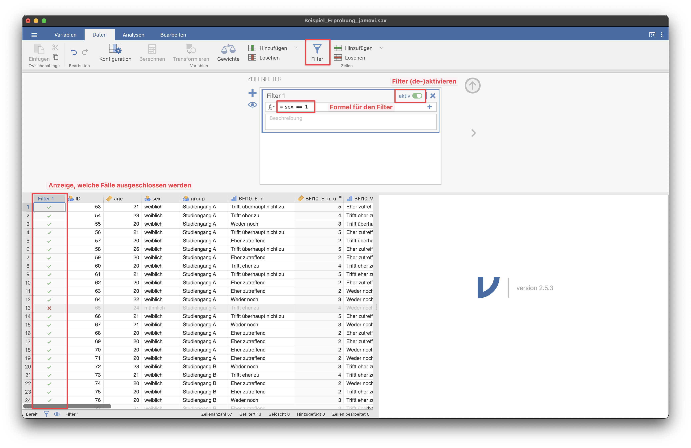
