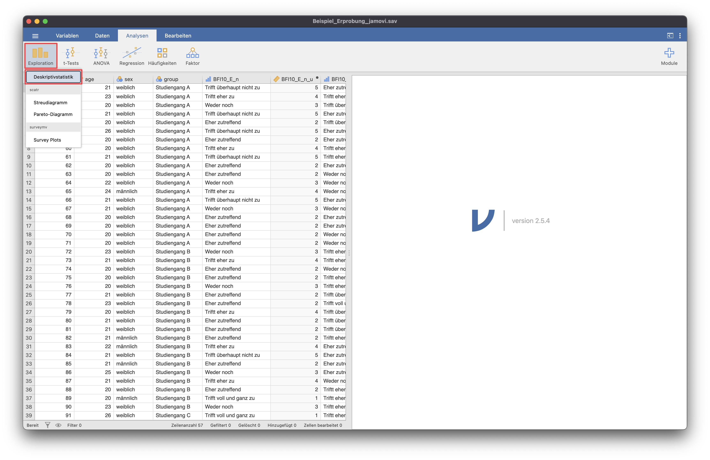
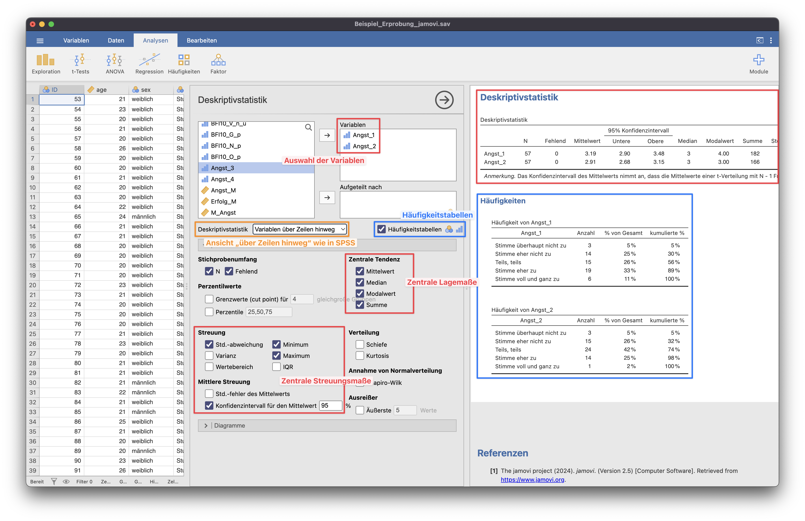

# Kennwerte
Kennwerte wie die Deskriptivstatistik, Zentrale Lage- oder Streuungsmaße und Häufigkeitstabellen findet man in jamovi im Menüpunkt "Deskriptivstatistik".

{: .info }
> Über ein Dropdown kann man auswählen, ob die Variablen über Spalten oder über Zeilen hinweg angezeigt werden sollen. Um die Werte wie in SPSS anzuzeigen, muss "Variablen über Zeilen hinweg" ausgewählt werden.

