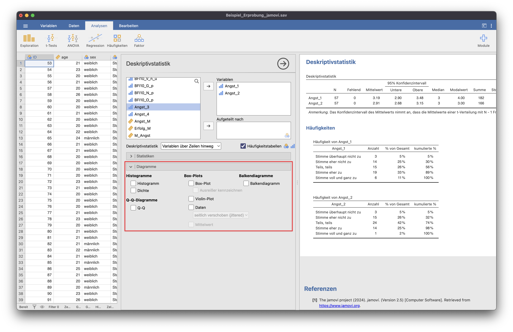
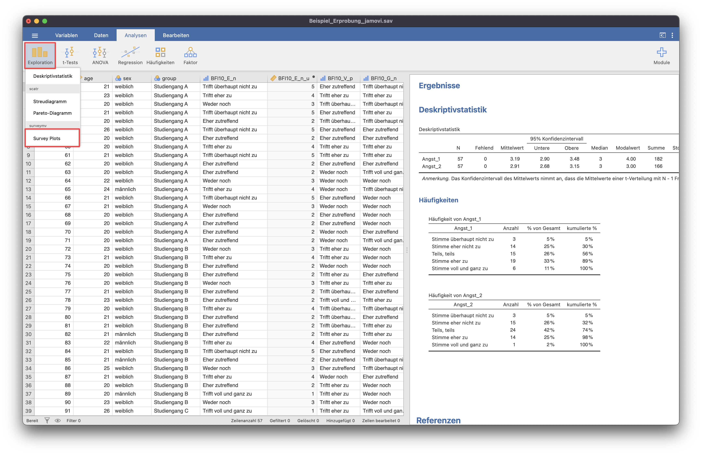
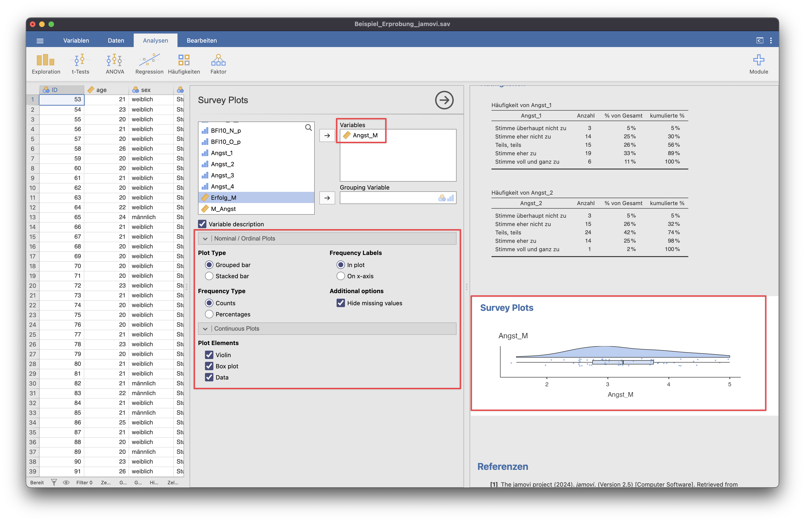
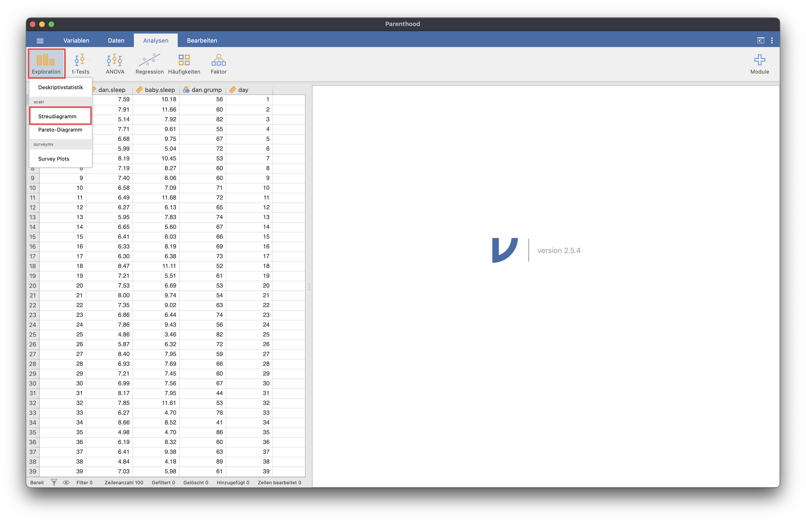
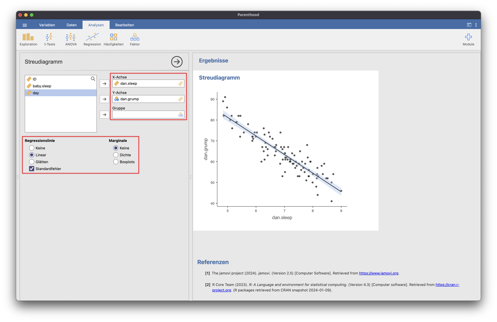
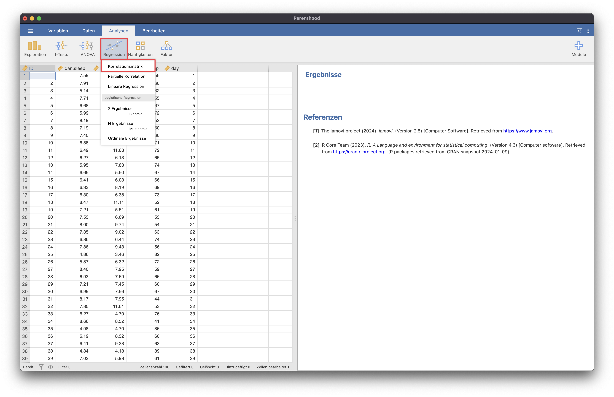
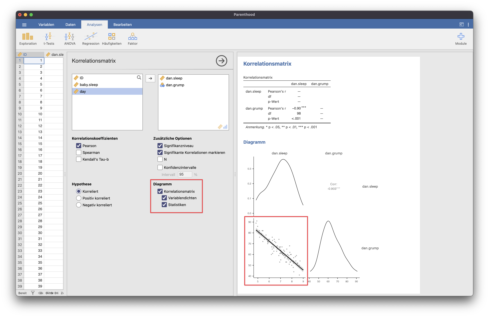

# Diagramme
Unter dem Menüpunkt "Deskriptivstatistik" ist eine Auswahl verschiedener Plots/Diagramme möglich: 
- Histogramm
- Dichte
- Q-Q
- Box-Plot
- Violin-Plot

## Raincloud-Plots

{: .info }
>Anleitung zur Installation von Zusatzmodulen [hier](../02_einrichtung/02_03_Zusatzmodule.html).

{: .wichtig }
>Surveyplots reagiert sensibel auf das Skalenniveau der Variable. Raincloud-Plots können nur aus Variablen mit dem Skalenniveau "Kontinuierlich" (Metrisch) erstellt werden.

## Streudiagramme
> *Für die Verdeutlichung wurde hier der Übungsdatensatz "Parenthood" genutzt.*

Scatter-Plots/Streudiagramme können entweder mithilfe eines Zusatzmoduls erstellt werden, oder über die Korrelationsmatrix.

### Zusatzmodul
Mithilfe des Zusatzmoduls *scatr* können einfach Streudiagramme erstellt werden.

### Korrelationsmatrix
Auch über die Korrelationsmatrix kann ein Scatterplot erstellt werden.

