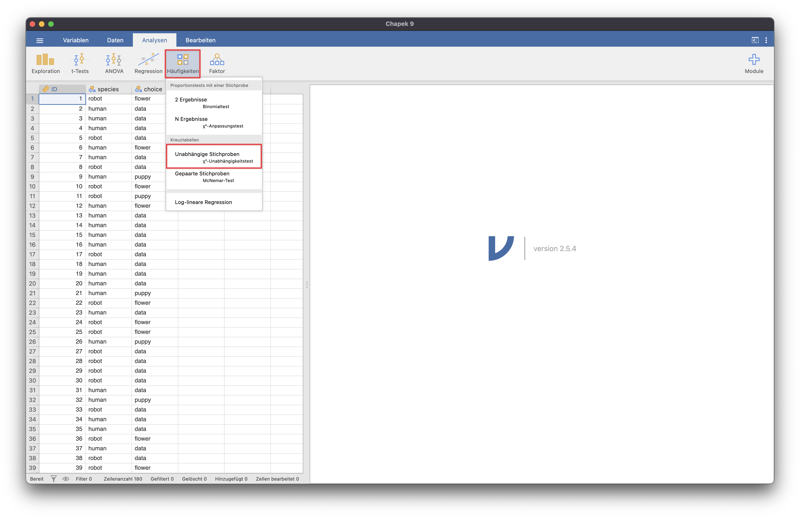
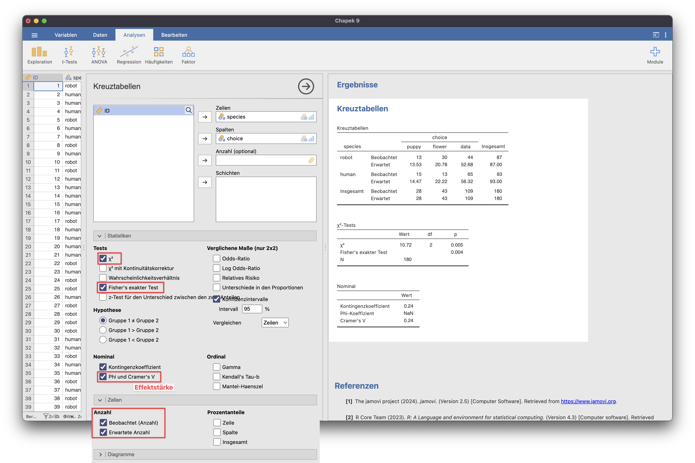
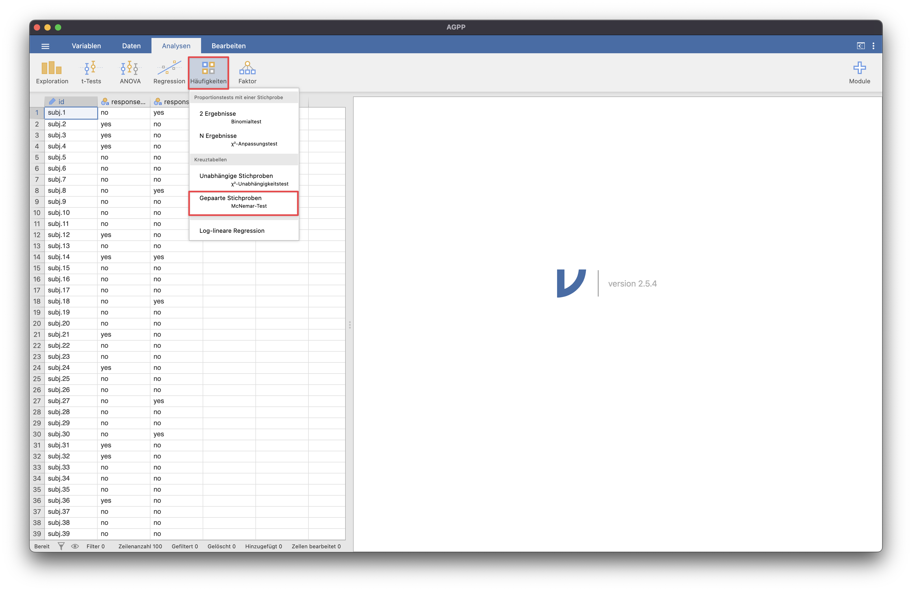
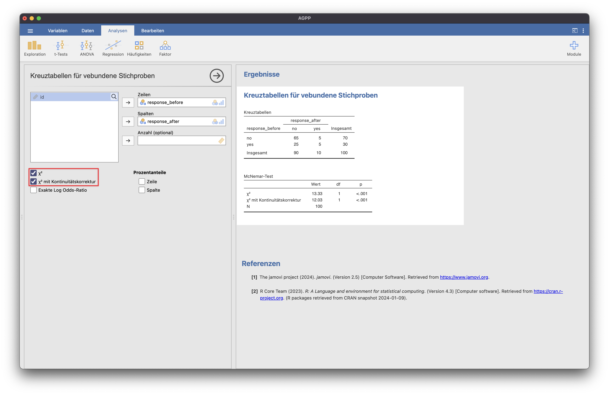

# Kreuztabellen

## Chi-Quadrat-Unabhängigkeitstest für Unabhängige Stichproben

{: .hinweis }
> Für die Beispiele wurde der Übungsdatensatz "Chapek 9" genutzt.

## McNemar-Test für Gepaarte Stichproben
Für Messwiederholungen wird der McNemar-Test genutzt.

{: .hinweis }
> Für die Beispiele wurde der Übungsdatensatz "agpp" genutzt.

