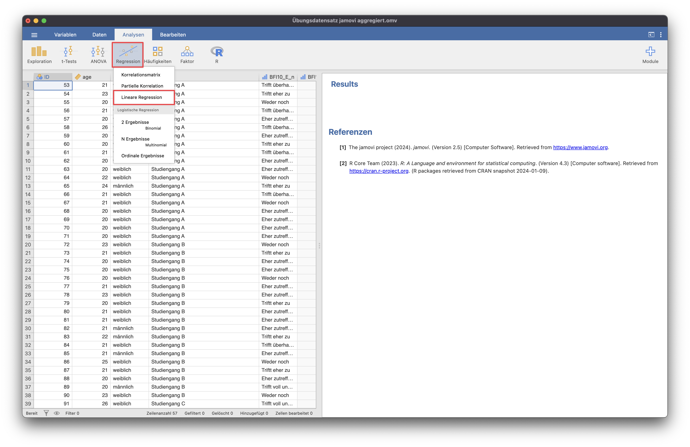
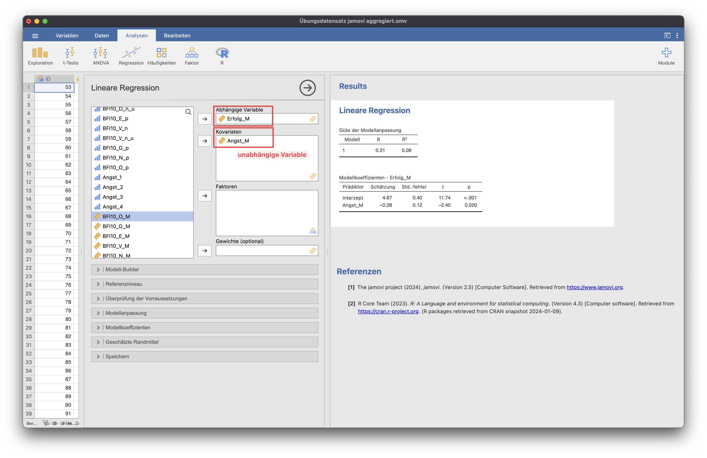

# Bivariate Regression
Die bivariate Regression wird verwendet, um zu prüfen, ob ein Zusammenhang zwischen zwei intervallskalierten Variablen besteht.

{: .hinweis }
> Hinweis: Für die Beispiele wurde der Datensatz "Übungsdatensatz jamovi aggregiert" genutzt.

