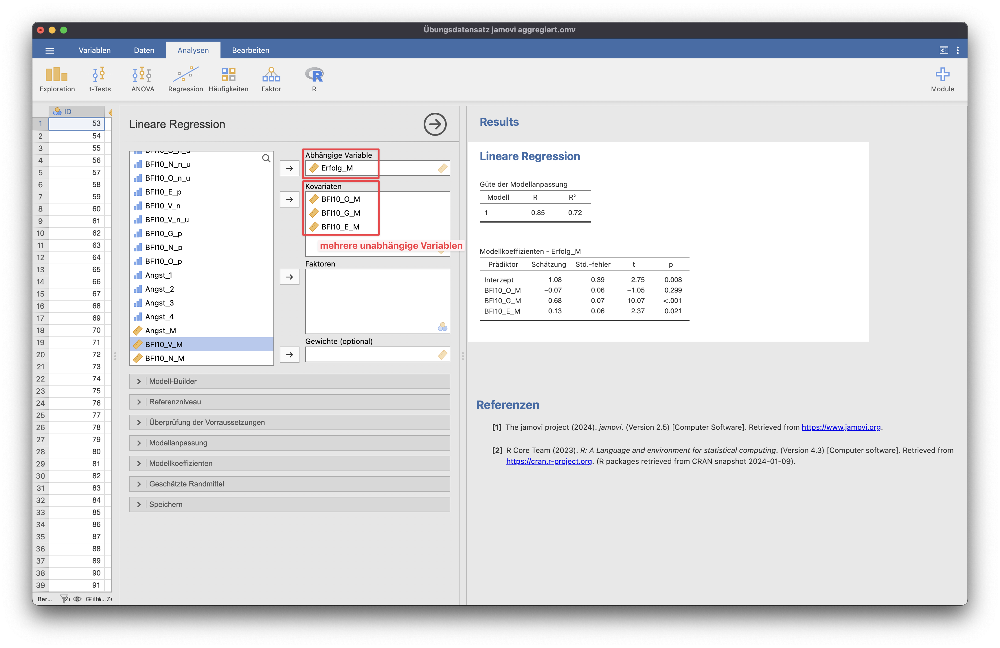

# Multiple Regression
Die multiple Regression wird genutzt, um zu prüfen, inwieweit mehrere Prädiktoren eine abhängige Variable vorhersagen können.

{: .hinweis }
> Hinweis: Für die Beispiele wurde der Datensatz "Übungsdatensatz jamovi aggregiert" genutzt.

Auswahl der für die Auswertung relevanten Maße:
*Standardisierter Schätzer* wird genutzt, um Variablen verschiedener Einheiten zu vergleichen, beispielsweise eine Likert-Skala (1-5) mit einer Bewertung auf einer Skala von 0-100.

