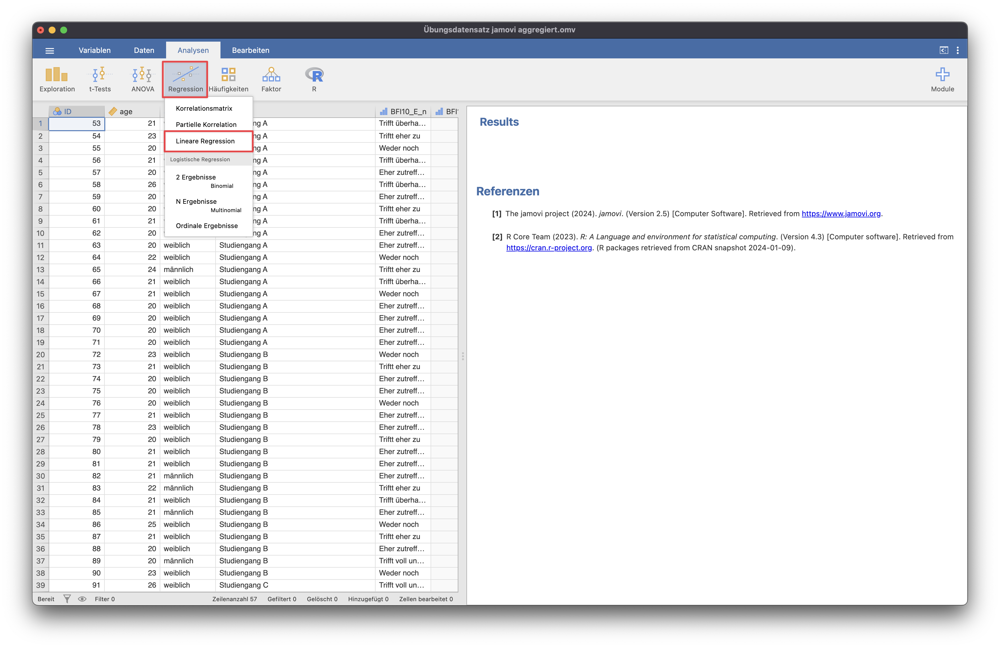

# Hierarchische Regression
Die hierarchische Regression wird genutzt, um zu prüfen, ob durch Hinzunahme weiterer Prädiktoren zusätzliche Anteile an erklärter Varianz aufgeklärt werden.

{: .hinweis }
> Für die Beispiele wurde der Datensatz "Übungsdatensatz jamovi aggregiert" genutzt.

Die hierarchische Regression findet sich unter dem Menüpunkt "Regression" unter "Lineare Regression".

Dort können die abhängige und mehrere unabhängige Variablen eingetragen werden, die untersucht werden sollen.
Unter **Modell-Builder** können die unabhängigen Variablen in Blöcke eingeteilt werden, welche nacheinander in die Regression hinzugenommen werden.

Über den Pfeil werden Variablen den verschiedenen Blöcken hinzugefügt.
Die Auswertung zeigt nun, wie viel mehr erklärte Varianz aufgeklärt wird, wenn der zweite Block an Variablen hinzugefügt wird.

Auswahl der für die Auswertung relevanten Maße: 
*Standardisierter Schätzer* wird genutzt, um Variablen verschiedener Einheiten zu vergleichen, beispielsweise eine Likert-Skala (1-5) mit einer Bewertung auf einer Skala von 0-100.

