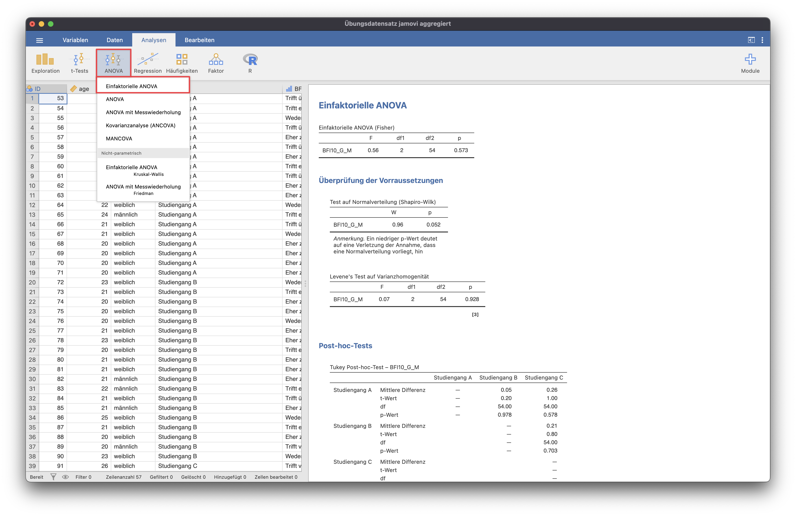
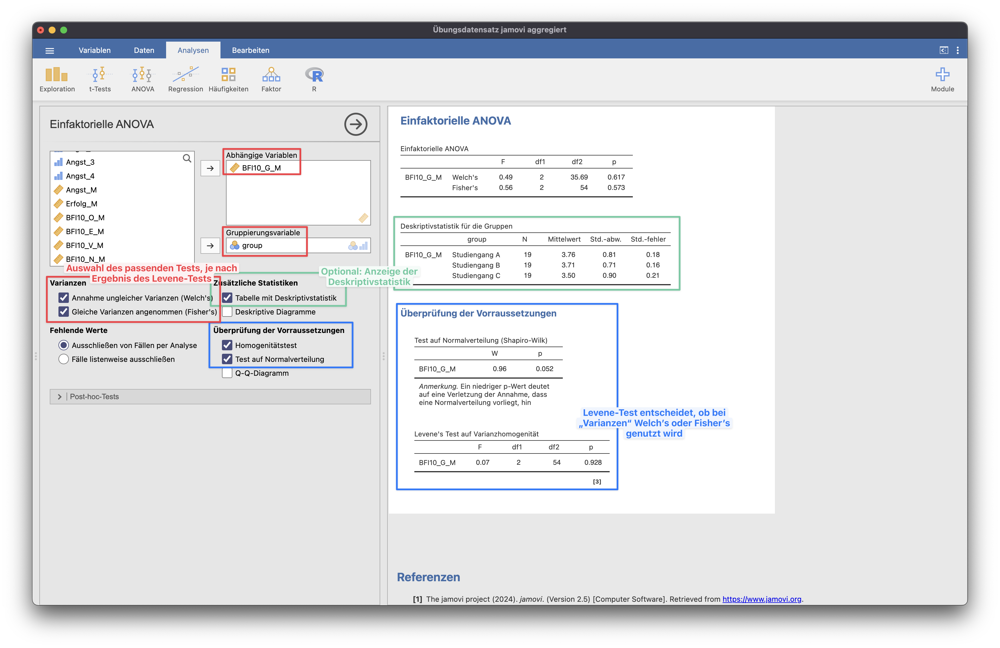
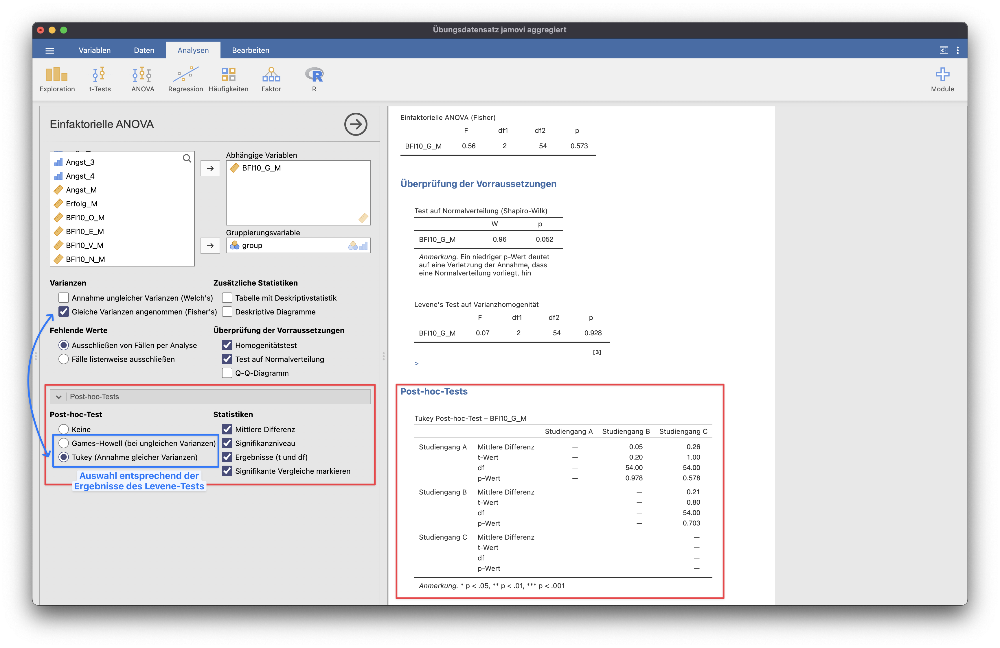
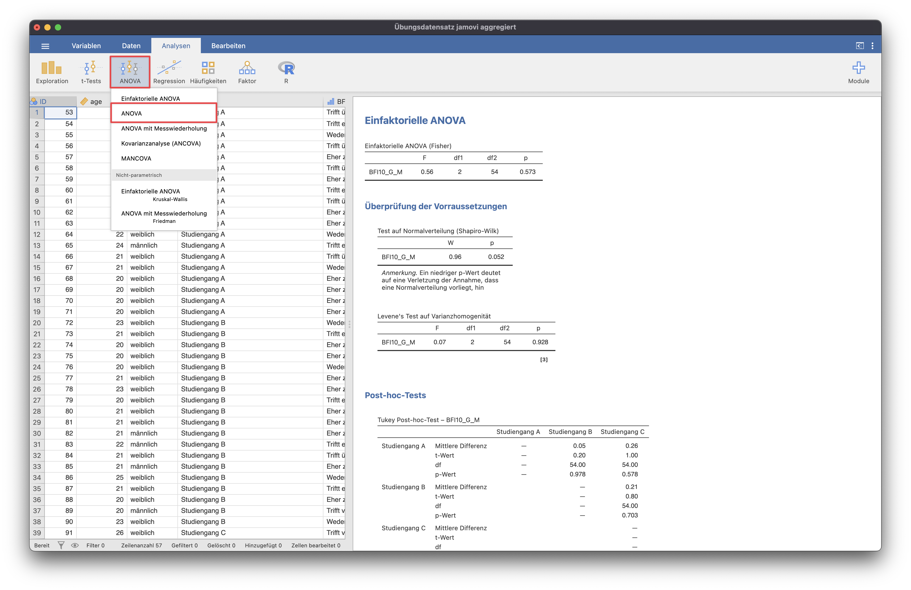
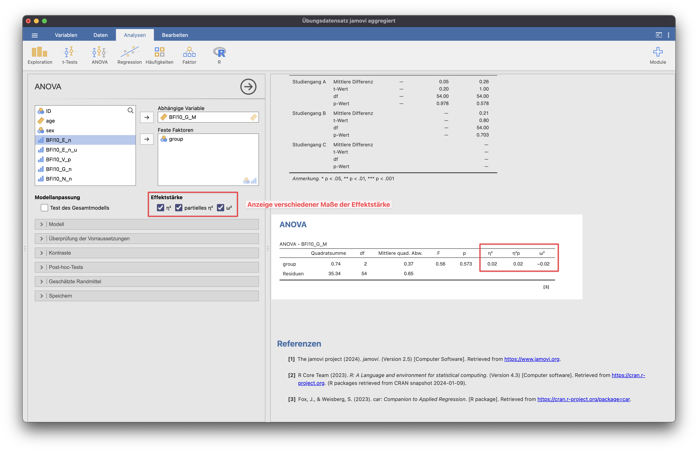

# Einfaktorielle ANOVA
Die **einfaktorielle Varianzanalyse (ANOVA)** ist eine statistische Methode, die dazu verwendet wird, die Mittelwerte von mehr als zwei Gruppen zu vergleichen, um festzustellen, ob es signifikante Unterschiede zwischen diesen Gruppen gibt.

{: .hinweis }
> Für die Beispiele wurde der Datensatz "Übungsdatensatz jamovi aggregiert" genutzt.

Die einfaktorielle ANOVA findet sich im Menüpunkt "ANOVA".

Bei der einfaktoriellen ANOVA müssen die Voraussetzungen der Normalverteilung und der Varianzhomogenität geprüft werden.
Je nachdem, ob Varianzhomogenität vorliegt oder nicht, muss entweder der Welch- oder der Fisher-Test ausgewählt werden.
Optional können zusätzlich die Deskriptivstatistiken ausgegeben werden.

Da die ANOVA nur Auskunft darüber gibt, ob ein Unterschied zwischen den Gruppen vorliegt, aber nicht darüber, welche Gruppen sich unterscheiden, ist ein Post-hoc-Test notwendig.
Auch hier richtet sich die Auswahl danach, ob die Annahme der Varianzhomogenität bestätigt wurde oder nicht.

## Effektstärke

Um die Effektstärke der einfaktoriellen ANOVA zu ermitteln, wird die Funktion "ANOVA" benötigt. Hier können verschiedene Maße der Effektstärke, wie Eta-Quadrat (η²), partielles Eta-Quadrat (η²p) oder McDonalds Omega (ω²) angezeigt werden.

