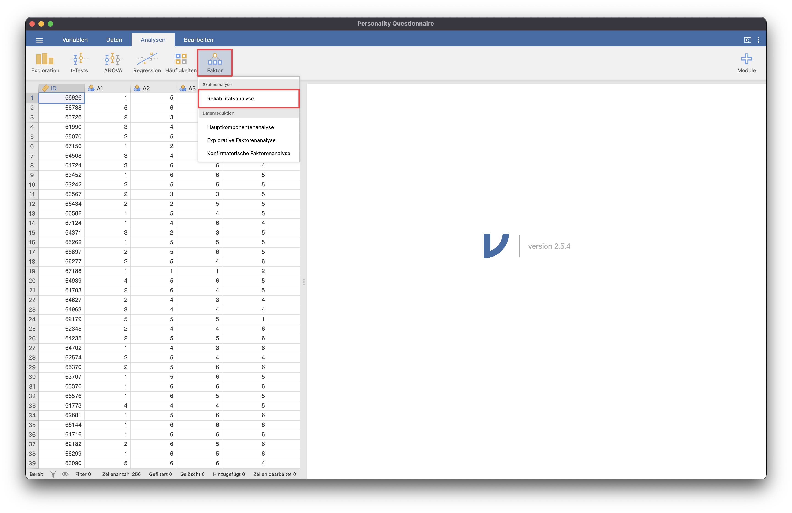
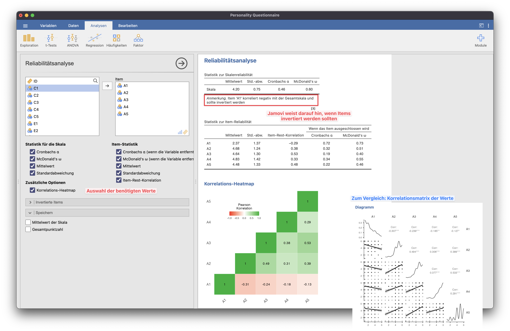
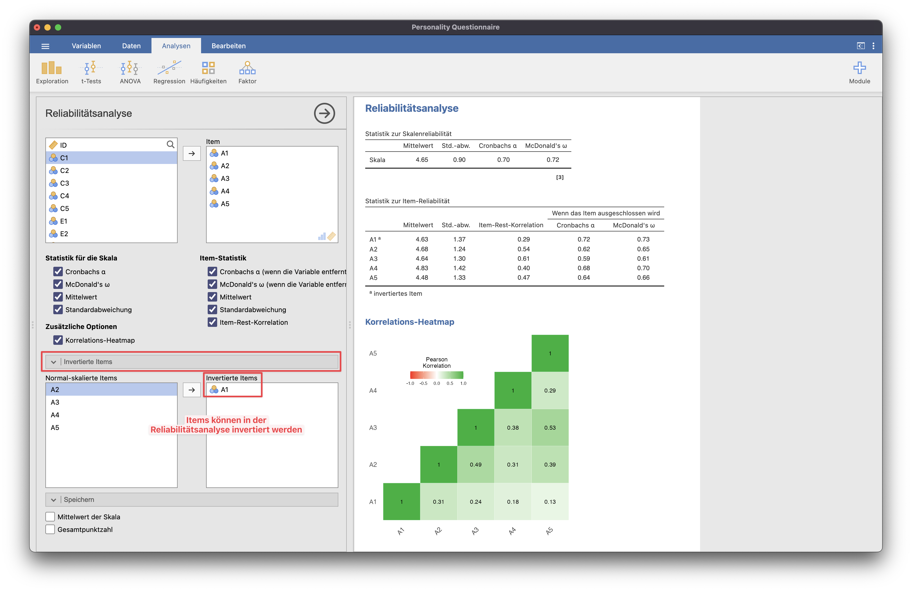
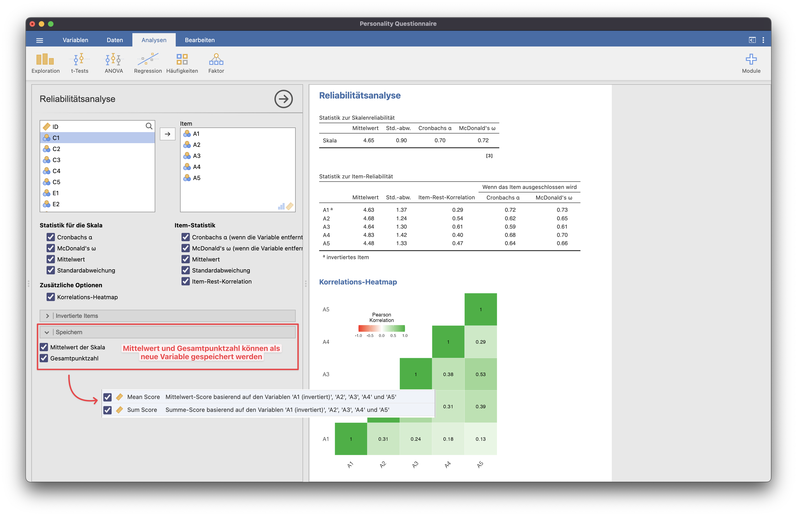

# Reliabilitätsanalyse

{: .hinweis }
> Für die Beispiele wurde der Übungsdatensatz "Personality Questionnaire" genutzt.

Die Reliabilitätsanalyse findet sich im Menüpunkt "Faktor" unter den Skalenanalysen.

Es können sich sowohl die Werte der Reliabilitätsanalyse als auch die Korrelations-Heatmap ausgeben gelassen werden.
Außerdem weist jamovi darauf hin, wenn ein Item negativ mit der Gesamtskala korreliert und daher invertiert werden sollte.

Das Invertieren der Items kann direkt in der Reliabilitätsanalyse vorgenommen werden.

Außerdem ist es möglich, den Mittelwert der Skala und die Gesamtpunktzahl direkt in einer neuen Variable zu speichern.
Diese neuen Variablen verhalten sich genau so, wie durch "Berechnen" erstellte neue Variablen.

